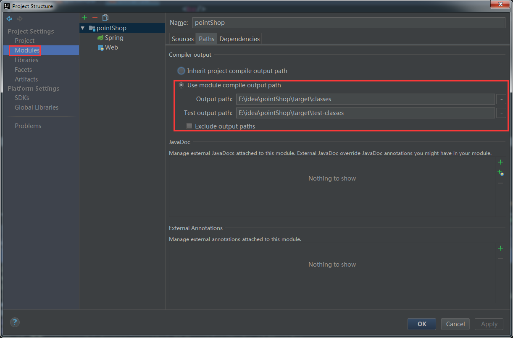

# idea导入maven项目并配置在tomcat中运行

http://blog.csdn.net/txvaqh/article/details/52824492

## 1:导入一个maven项目

一定要选择maven.

然后一路next,最后完成

## 2,配置tomcat运行

。部署到tomcat我们可以有两种方式，一种是利用tomcat插件来进行部署，另一种是下载tomcat服务器来来进行配置

这里只介绍第二种

**a.下载tomcat并解压到一个目录** 
**b.打开运行配置，添加一个tomcat服务器 **

**c.配置tomcat路径，和端口** 

**d.配置 Artifacts(即部署项目的方式)**

一般一个module对应两种类型的Artifact，一种是war，一种是war explored。

war就是已war包形式发布，

war explored是发布文件目录.

**e.再看web.xml的路径是否正确,一般情况下,如果是标准maven项目都是正确的**

**f.再看Moudels里面 path选项的配置是否正确,即 classes的输出目录,maven项目就是 target,同上,如果是标准 maven项目的结构,这步通常页不需要修改**.

**g.最后再看maven所依赖的jar包是否都在**

**h.最后一步: tomcat配置,选择部署的方式,这是我们在 d 步骤下配置的 Artifact 方式,选择, war exploded**,

## 运行即可

## 参考: [intellij idea让资源文件自动更新]()

