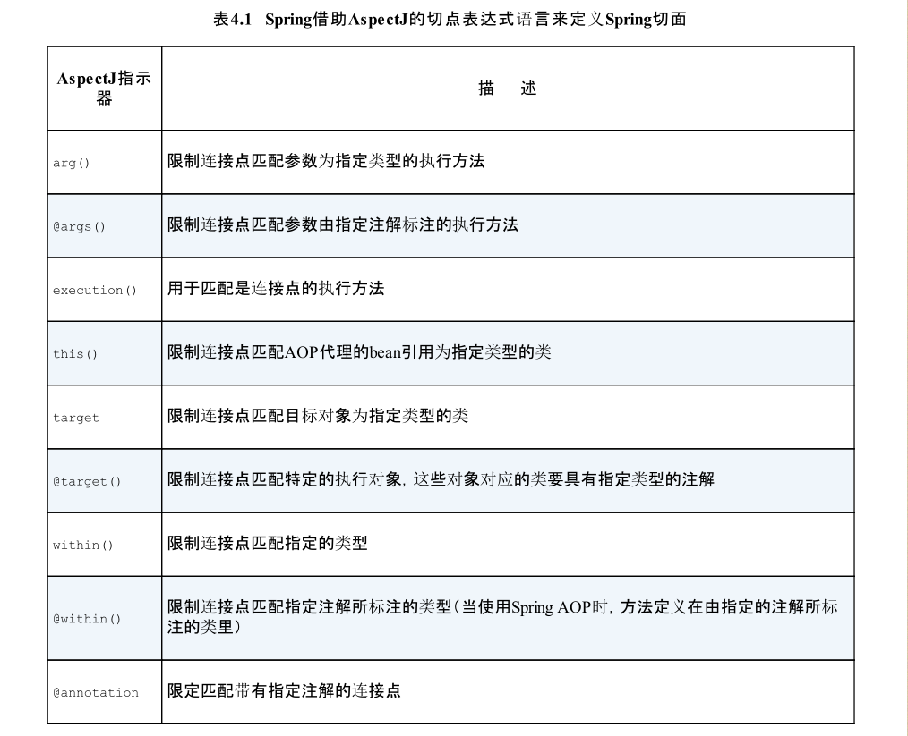

# 面向切面的Spring


## 定义AOP术语

描述切面的常用术语有:

* 通知 (advice)
* 切点 (pointcut)
* 连接点 (joinpoint)

下图展示了这些概念是如何关联的


## Spring 对AOP的支持

Spring提供了四种类型的Aop支持

* 基于代理的经典SpringAop
* 纯 POJO切面
* @AspectJ注解驱动的切面
* 注入式AcpectJ切面(适用于Spring各版本)

前三种,都是SpringAOP实现的变体,Spring AOP构建在动态代理的基础之上.因此Spring对Aop的支持局限于方法拦截.

## Spring 在运行时通知对象

通过在代理类中包裹切面,Spring在运行期把切面织入到spring管理的bean中,如图,代理类风闸u那个了目标类,并拦截被通知方法的调用,再把调用转发给真正的目标bean.
当代理拦截到方法调用时,在调用目标bean方法之前,会执行切面逻辑.


**需要注意的是:知道应用需要被代理的Bean时,spring才会创建代理对象.并且,Spring只支持方法级别的连接点.**

## 编写切点

切点用于准确定位应该在什么地方应用切面的通知.同志和切点是切面的最基本元素.因此,了解如何编写切点非常重要.

关于Spring AOP的AspectJ切点，最重要的一点就是Spring仅支持AspectJ切点指示器（pointcutdesignator）的一个子集。
让我们回顾下，Spring是基于代理的，而某些切点表达式是与基于代理的AOP无关的。表4.1列出了Spring AOP所支持的AspectJ切点指示器。



在Spring中尝试使用AspectJ其他指示器时，将会抛出IllegalArgument-Exception异常。

为了阐述Spring中的切面,我们需要一个主题来定义切面的切点.我们定义一个 Performance 接口:

```java
package com.itguang.demo.aop;

public interface Performance {
    public void  perform();
}
```
Performance  可以代表任何类型的现场表演，如舞台剧、电影或音乐会。假设我们想编写Performance的perform()方法触发的通知。
下图 展现了一个切点表达式，这个表达式能够设置当perform()方法执行时触发通知的调用。


**我们使用 execution()指示器,选择proformance的perform()方法.**
**方法表达式以 * 开始,表明我们不关心方法的返回值类型.然后我们指定了全限定类名和方法名.对于方法参数列表,我们使用两个点号 (..) 表明切点要选择任意的 perform() 方法,无论方法的入参是什么**

现在假设我们需要配置的切点仅匹配concert包.在此场景下,可以使用within()指示器来限制匹配.


**请注意我们使用了 && 操作符把 execution()和within()指示器连接在一起形成 and 关系.**
类似的,我们可以使用 || 操作符标识 or 关系,而使用 ! 操作符标识 not 操作.
因为“&”在XML中有特殊含义，所以在Spring的XML配置里面描述切点时，我们可以使用and
来代替“&&”。同样，or和not可以分别用来代替“||”和“!”。

## 定义切面

我们已经定义了 Performance接口,它是切面中切点的目标对象,现在让我们使用AspectJ注解来定义切面.

```java
/**
 * 观看演出的切面
 *
 * @author itguang
 * @create 2017-11-06 16:24
 **/
@Aspect
public class Audience {

    /**
     * 手机静音
     */
    @Before("execution(* com.itguang.demo.aop.Performance.perform(..))")
    public void  silenceCellPhone(){
        System.out.println("Silence Cell Phone");
    }

    /**
     * 就做
     */
    @Before("execution(* com.itguang.demo.aop.Performance.perform(..))")
    public void takeSeats(){
        System.out.println("Taking seats");
    }


    /**
     * 鼓掌
     */
    @AfterReturning("execution(* com.itguang.demo.aop.Performance.perform(..))")
    public void applause(){
        System.out.println("pa pa pa");
    }

    /**
     * 表演失败(异常),退款
     */
    @AfterThrowing("execution(* com.itguang.demo.aop.Performance.perform(..))")
    public void demandRefund(){
        System.out.println("Demanding a refund");
    }
}
```

Audience 类使用了 @AspectJ 注解进行了标注.该注解表明 Audience不仅仅是一个 POJO,还是一个切面.Audience类中的方法都适用注解定义切面的具体行为.

> Audience有四个方法，定义了一个观众在观看演出时可能会做的事情。在演出之前，观众要
  就坐（takeSeats()）并将手机调至静音状态（silenceCellPhones()）。如果演出很精彩
  的话，观众应该会鼓掌喝彩（applause()）。不过，如果演出没有达到观众预期的话，观众会
  要求退款（demandRefund()）。

**AspectJ提供了5个注解来定义通知**


上面的代码 相同的切点表达式我们重复了四遍，这样的重复让人感觉有些不对劲。如果我们只定义这个切点一次，然后每次需要的时候引用它，那么这会是一个很好的方案。
幸好，我们完全可以这样做：@Pointcut注解能够在一个@AspectJ切面内定义可重用的切点.

```java
/**
 * 观看演出的切面
 *
 * @author itguang
 * @create 2017-11-06 16:49
 **/
@Aspect
public class Audience2 {

    @Pointcut("execution(* com.itguang.demo.aop.Performance.perform(..))")
    public void performance(){

    }


    /**
     * 手机静音
     */
    @Before("performance()")
    public void  silenceCellPhone(){
        System.out.println("Silence Cell Phone");
    }

    /**
     * 就做
     */
    @Before("performance()")
    public void takeSeats(){
        System.out.println("Taking seats");
    }


    /**
     * 鼓掌
     */
    @AfterReturning("performance()")
    public void applause(){
        System.out.println("pa pa pa");
    }

    /**
     * 表演失败(异常),退款
     */
    @AfterThrowing("performance()")
    public void demandRefund(){
        System.out.println("Demanding a refund");
    }
}
```
**performance()方法的实际内容并不重要，在这里它实际上应该是空的。其实该方法本身只是一个标识，供@Pointcut注解依附。**

需要注意的是，除了注解和没有实际操作的performance()方法，Audience类依然是一个
POJO。我们能够像使用其他的Java类那样调用它的方法，它的方法也能够独立地进行单元测
试，这与其他的Java类并没有什么区别。Audience只是一个Java类，只不过它通过注解表明
会作为切面使用而已。

像其他的Java类一样，它可以装配为Spring中的bean：

```java
 @Bean
    public Audience2 audience2(){
        return new Audience2();
    }
```
如果你使用JavaConfig的话，可以在配置类的类级别上通过使用EnableAspectJAutoProxy注解启用自动代理功能。

```java
/**
 * AOP config
 *
 * @author itguang
 * @create 2017-11-06 16:53
 **/
@Configuration
@EnableAspectJAutoProxy
public class AOPConfig {

    @Bean
    public Audience2 audience2(){
        return new Audience2();
    }

}
```

不管你是使用JavaConfig还是XML，AspectJ自动代理都会为使用@Aspect注解的bean创建一个代理，这个代理会围绕着所有该切面的切点所匹配的bean。，Audience类中的通知方法将会在perform()调用前后执行。

## 创建环绕通知

环绕通知是最为强大的通知类型.他能够让你所编写的逻辑将被通知的方法完全包装起来.实际上就像在一个方法中同时编写前置通知和后置通知.

```java
/**
 * 使用环绕通知的Audience切面
 *
 * @author itguang
 * @create 2017-11-06 17:03
 **/
@Aspect
public class Audience3 {

    @Pointcut("execution(* com.itguang.demo.aop.Performance.perform(..))")
    public void performance(){
    }

    @Around("performance()")
    public void watchPerformance(ProceedingJoinPoint jp){
        try {
            System.out.println("Silence Cell Phone");
            System.out.println("Taking seats");
            //将控制权交给被通知的方法,即调用被通知的方法
            jp.proceed();
            System.out.println("pa pa pa");
        }catch (Throwable e){
            System.out.println("Demanding a refund");
        }
    }

}
```

在这里,@Around 注解表明 watchPerformance()方法将会作为 perdormance() 切点的环绕通知.

**关于这个心得通知方法,你注意到的可能是 它接受ProceedingJoinPoint 作为参数.这个对象是必须要有的,因为你要在通知中通过它来调用被通知的方法.**

需要注意的是，别忘记调用proceed()方法。如果不调这个方法的话，那么你的通知实际上
会阻塞对被通知方法的调用。有可能这就是你想要的效果，但更多的情况是你希望在某个点
上执行被通知的方法。

有意思的是，你可以不调用proceed()方法，从而阻塞对被通知方法的访问，与之类似，你也
可以在通知中对它进行多次调用。要这样做的一个场景就是实现重试逻辑，也就是在被通知
方法失败后，进行重复尝试。


  
  
  

  


