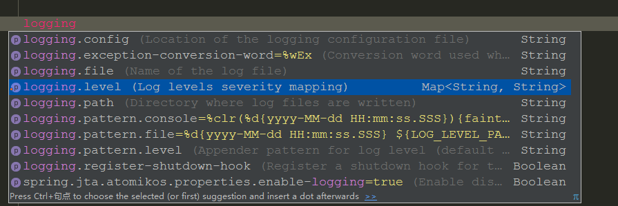

# Springboot 外置配置

> spring Boot 自动配置的bean提供了300多个用于微调的属性.当调整设置时,只需要在环境变量,Java系统属性,JNDI,命令行参数,属性文件进行配置 就好了.

## 举例:

假设我们想要禁止启动springboot应用时的 banner .有以下几种方法:

### 1.在属性文件中指定 application.properties
```
spring.main.show-banner=false
```
### 2.在 应用程序的命令行参数中指定

```
$ java -jar myapp.jar --spring.main.show-banner=false
```

### 3.还可以将属性设置为环境变量

如果你用的是bash或者zsh,可以使用 export 命令
```
$ export spring.main.show-banner=false
```

## 配置嵌入式服务器

从命令行运行springboot应用程序时,应用程序会启动一个嵌入式的服务器,监听8080端口.如果想要修改默认端口,
可以使用命令行参数

```
$ java -jar myapp.jar --server.port=80
```

## 配置日志

默认情况下,springboot会使用 Logback来记录日志,并用INFO级别输出到控制台.

**使用其他日志替换掉Logback**

一般来说,你不需要切换日志实现,Logback能很好满足你的需要.但是如果你决定要使用Log4j 或者Log4j2,

你只需要修改依赖:引入对应的日志实现的起步依赖,同时排除掉Logback 即可.

以maven为例:

**在maven里,可以用<exclusions> 来排除传递依赖**

```xml
<dependency>
			<groupId>org.springframework.boot</groupId>
			<artifactId>spring-boot-starter-web</artifactId>
			<exclusions>
				<exclusion>
					<groupId>org.springframework.boot</groupId>
					<artifactId>spring-boot-starter-log</artifactId>
				</exclusion>
			</exclusions>
		</dependency>
```
然后加入Log4j的起步依赖即可

```xml
        <dependency>
			<groupId>org.springframework.boot</groupId>
			<artifactId>spring-boot-starter-log4j</artifactId>
		</dependency>
```
**设置日志级别和日志输出文件位置:**

在applecation.properties 中以logging开头.

在 idea中会有很好的提示



## 配置数据源

在配置文件中

```
########################
#数据库配置
##########################

spring.datasource.url=jdbc:mysql://localhost:3306/test
spring.datasource.username=root
spring.datasource.password=root
spring.datasource.driver-class-name=com.mysql.jdbc.Driver

spring.jpa.properties.hibernate.hbm2ddl.auto=update
# 主要是指定生成表名的存储引擎为InneoDB
spring.jpa.properties.hibernate.dialect=org.hibernate.dialect.MySQL5InnoDBDialect
# 是否打印出自动生产的SQL，方便调试的时候查看
spring.jpa.show-sql= true
```

在自动配置 dataSource Bean的时候,Spring boot会使用这里的连接数据.

**DataSource是一个连接池,如果Classpath下有Tomcat的连接池 DataSource,那么就会使用这个连接池,否则Spring Boot会在Classpath里查找一下连接池:**

* HikariCp
* Commons DBCP
* Commons DBCP2

这里列出的是自动配置支持的连接池.你还可以配置DataSource的Bean,使用你喜欢的各种连接池.

如果我们想要使用 druid 连接池,如何做呢,其实关于 druid,已经有一个起步依赖:

```xml
<dependency>
			<groupId>com.alibaba</groupId>
			<artifactId>druid-spring-boot-starter</artifactId>
			<version>1.1.0</version>
		</dependency>
```
只需要添加这个依赖,Springboot就会自动检测Classpath下是否有druid存在,如果有,就是用它.

## 在一个类里收集属性

现在我们在 applecation.properties 中有一个属性值,以weixin开头

```
#####################
#在一个类里收集属性
######################

weixin.appid = 12346
```
我们要在Controller里获取这个属性值,现在我们考虑用一个属性类来获取所有与weixin相关的配置信息,

新建一个类 WeixinProperties.java

```java
/**
 * 收集配置文件的weixin 前缀属性
 *
 * @author itguang
 * @create 2017-11-04 10:47
 **/
@Component
//注入带 weixin 前缀的属性
@ConfigurationProperties(prefix = "weixin")
public class WeixinProperties {


    private String appid;

    //提供getter 和 setter方法
    public String getAppid() {
        return appid;
    }

    public void setAppid(String appid) {
        this.appid = appid;
    }
}

```

因为使用了@Component注解,所以这个属性类是一个Bean,这样我们就可以在Controller里把它注入进来:

```java
@RestController
public class WeixinController {

    @Autowired
    private WeixinProperties weixinProperties;

    @RequestMapping(value = "test")
    public String test(){

      return   weixinProperties.getAppid();
    }
}
```

## 使用 Profile进行配置

当应用程序需要部署到不同的运行环境中去,一些配置细节通常会有所不同.
比如数据库连接的细节在开发环境和测试环境就会不一样,在生产环境下又会不一样.
Spring Framework 从Spring3.1开始支持基于Profile的配置.
**Profile是一种条件化配置,基于运行时激活的Profile,会使用或者激活不同的Bean或者配置类.**

为了演示Profile的属性,假设我们希望针对生产环境和开发环境有不同的配置.该怎莫做呢?这取决于你是用的是属性文件配置还是YAML配置.

这里我们以属性配置文件为例
### 使用特定基于Profile的属性文件

如果你正在使用 application.properties ,可以创建两个额外的属性文件,遵循 application-{profile}.properties这种命名格式.

在日志这个例子里,开发环境的配置放在 application-devlopment.properties
```
logging.level.root=debug
```
生产环境的配置放在  application-production.properties
```
logging.level.root= warn
```

如何激活呢,在application.properties设置 `spring.profiles.active` 属性就能激活特定的Profile.

```
######################
#日志配置
#####################
# 设置激活特定的Profile
spring.profiles.active=devlopment
```

或者在命令行启动程序时,指定激活的Profile

```
$ java -jar myapp.jar --spring.profiles.active=devlopment

```
另外我们还可以在java配置类里面指定特定的Profile
```java
/**
 * 指定特定Profile的配置类
 *
 * @author itguang
 * @create 2017-11-04 11:23
 **/
@Configuration
@Profile("devlopment")
public class ProfileConfigTest {
    
}
```

**需要注意的是,application.properties 属性文件中的配置对所有的Profile都生效.**


